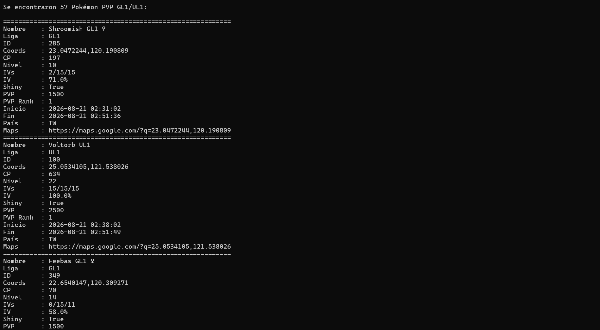
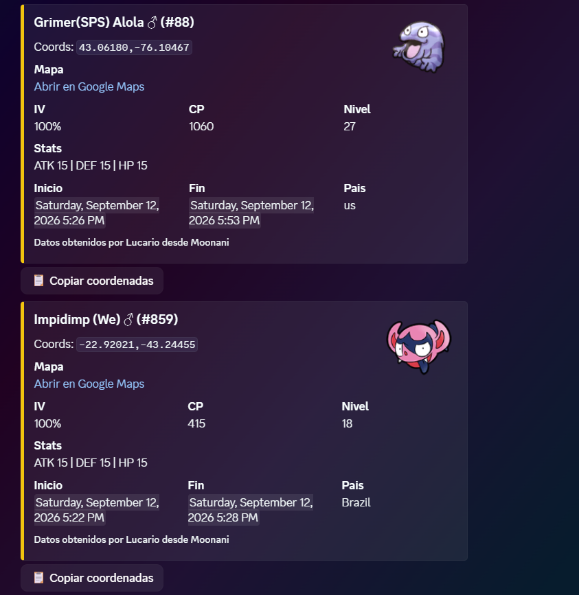

# 🤖 Lucario - Moonani Discord Pokemon Go Coordinates Bot


Bot de Discord desarrollado en Python que consulta el endpoint de Moonani PokeList e iFlowGo para obtener apariciones de pokemones, raids, quests y más; extrae coordenadas y las publica en Discord mediante comandos.

Antes de empezar, recuerda que puedes unirte a nuestro servidor en discord para revisar el funcionamiento del bot online 👇

<a href="https://discord.gg/ZbHNXpUexC" target="_blank">
  
</a>

Si tu idioma nativo es el inglés, puedes revisar el README.md en ese idioma: [README.md](https://github.com/KernelX-debug/Discord-Bot_Lucario_Moonaniphp/blob/main/README.md)

If your native language is English, you can check the README.md in that language: [README.md](https://github.com/KernelX-debug/Discord-Bot_Lucario_Moonaniphp/blob/main/README.md)


## Que hace este proyecto. ¿A que quiero llegar?

- Consulta el endpoint `https://moonani.com/PokeList/ajax.php?page=pokemon&action=load`
- Consulta las 40 páginas del endpoint `https://pokecoords.iflowgo.com/iflowgopokecoords/api/v1/pokemon-search`
- De ser necesario, para tareas más exigentes consulta `https://pokecoords.iflowgo.com/iflowgopokecoords/api/v1/nearby?lat=40.7&lon=-89.65&radius_km=25&layers=spawns%2Craids%2Cquests&limit=800`, en el cual, las variables `lat` y `lon` varían de acuerdo a las 189 entradas del `hotspots.json` alojado en este repositorio.
- Consulta información de rockets, raids y quests de la página web moonani
- Limpia el HTML que devuelve Moonani en campos como nombre, IV, coordenadas y pais
- Extrae coordenadas listas para copiar y pegar, además de link redirigido a google maps
- Permite buscar por nombre parcial
- De momento filtra los pokemones randomiv, iv100, iv0 y pvp rank1
- Responde en Discord con mensajes compactos y directos
- Tiene la capacidad de enviar contenido multimedia de acuerdo al pokemón aparecido en estado salvaje

## Estructura indispensable del proyecto

- `discord_bot.py`: punto de entrada del bot y definicion de comandos
- `moonani_client.py`: cliente HTTP y logica de parseo/filtrado de resultados
- `iflowgo_client.py`: cliente HTTP y logica de parseo/filtrado de resultados
- `poketest.py`: script base limpio usado para validar la idea original
- `pvptest.py`: script base limpio usado para validar la idea de la funcion pvp en el juego
- `raidtest.py`: script base limpio usado para validar la idea de la función de raids en el juego
- `rockettest.py`: script base limpio usado para validar la idea de la función de rockeets en el juego
- `questtest.py`: script base limpio usado para validar la idea de la función de quests en el juego
- `.env`: variables de entorno (No compartir estos datos con terceros)
- `requirements.txt`: dependencias del proyecto

## 🔎 Comandos disponibles en discord (22)
**Comandos para todos los usuarios de discord (@everyone)**

- `/ping`: verifica si el bot esta en linea
- `/pokemon100`: muestra resultados con formato enriquecido para pokemones iv100
- `/pokemon0`: muestra resultados en formato enriquecido para pokemones iv0
- `/buscar`: busca un Pokemon por nombre e IV minimo en todos los hotspots globales de iFlowGo
- `/coordsiv100`: devuelve coordenadas en formato compacto de pokemones iv100 para copiar con facilidad
- `/coordsiv0`: devuelve coordenadas en formato compacto de pokemones iv0 para copiar con facilidad
- `/raid`: muestra resultados con formato enriquecido para raids a nivel global
- `/rocket`: muestra resultados con formato enriquecido para rockets a nivel global
- `/quest`: muestra resultados con formato enriquecido para quests a nivel global
  
**Comandos para uso administrativo en discord (permisos de administrador)**

- `/agregar_canal_iv100`: permite configurar un canal específico para enviar alertas de pokemones iv100 de forma constante y actualizada
- `/agregar_canal_iv0`: permite configurar un canal específico para enviar alertas de pokemones iv0 de forma constante y actualizada
- `/ver_canales_iv`: muestra los canales globales iv100 e iv0 guardados
- `/quitar_canal_iv100`: desactiva los avisos globales iv100 en el canal antes configurado
- `/quitar_canal_iv0`: desactiva los avisos globales iv0 en el canal antes configurado
- `/agregar_canal_pvp_gl1`: permite configurar un canal específico para enviar alertas de los pokemones rank1 de la Great League
- `/agregar_canal_pvp_ul1`: permite configurar un canal específico para enviar alertas de los pokemones rank1 de la Ultra League
- `/ver_canales_pvp`: muestra canales globales pvp GL1 y UL1 guardados
- `/quitar_canal_pvp_gl1`: desactiva los avisos pvp GL1 en el canal configurado
- `/quitar_canal_pvp_ul1`: desactiva los avisos pvp UL1 en el canal configurado
- `/agregar_seguimiento`: agrega alertas de un pokemón específico iv100 en un canal
- `/ver_seguimientos`: ver todos los seguimientos de pokémon iv100 configurados
- `/quitar_seguimiento`: quitar alertas de un pokemón específico iv100 del canal

## Requisitos

- Windows SO (Recomendado)
- Python 3.13 (recomendado)
- Un bot creado en el [Discord Developer Portal](https://discord.com/developers/applications) (Obligatorio)
- Cuenta en Railway u otra "cloud platform" para uso del bot 24/7 sin tener la compu encendida (Opcional)
- Acceso administrativo en el servidor de discord donde se gusta acoplar este servicio (Obligatorio)

# SI BUSCAS DE FORMA DIRECTA LA CONFIGURACIÓN DEL BOT EN DISCORD PUEDES SALTARTE ESTA PARTE E IR [AQUÍ](https://github.com/KernelX-debug/Discord-Bot_Lucario_Moonaniphp/blob/main/Spanish.md#instalacion-para-uso-como-bot-de-discord)‼️

## Prueba de funcionamiento breve para pokemones

Antes de usar el bot de Discord, es posible validar desde cero la extraccion y el parseo de datos del endpoint de Moonani con un script independiente. Esta prueba no requiere clonar el repositorio completo ni configurar Discord.

### 1. Crear una carpeta de trabajo

```powershell
mkdir prueba_moonani
cd prueba_moonani
```

### 2. Crear el archivo pre_poketest.py
Crea un archivo python llamado `pre_poketest.py` con este contenido:

```python
import requests
import re
import html

def extraer_coords(texto):
    match = re.search(r'data-clipboard-text="([^"]+)"', texto)
    return match.group(1) if match else ""

def limpiar_nombre(texto):
    
    texto = html.unescape(texto)
    
    texto = re.sub(r'<[^>]+>', '', texto)
    
    return texto.strip()

def extraer_pais(texto):
    texto = html.unescape(texto)
    texto = re.sub(r'<[^>]+>', '', texto).strip()
    return texto if texto else "??"

url = "https://moonani.com/PokeList/ajax.php?page=pokemon&action=load"
payload = {
    "iv": 100,
    "pvp": 0,
    "pokemons": "",
    "start": 0,
    "length": 230,
    "draw": 1
}
headers = {
    "Referer": "https://moonani.com/PokeList/index.php",
    "Content-Type": "application/x-www-form-urlencoded"
}

r = requests.post(url, data=payload, headers=headers)
data = r.json().get("data", [])

print(f"Total pokémones recibidos: {len(data)}\n")

for p in data:
    nombre = limpiar_nombre(p["Name"])
    coords = extraer_coords(p["Coords"])
    shiny  = "✨ SHINY" if p["Shiny"] == "Yes" else ""
    pais   = extraer_pais(p["Country"])

    print(f"{'='*50}")
    print(f"🎯 {nombre} #{p['Number']} {shiny}")
    print(f"📍 {coords}")
    print(f"⚡ CP: {p['CP']} | Nivel: {p['Level']}")
    print(f"💪 ATK:{p['Attack']} DEF:{p['Defense']} HP:{p['HP']}")
    print(f"⏱️  Inicio: {p['Start Time']}")
    print(f"⏱️  Fin:    {p['End Time']}")
    print(f"🌍 País: {pais}")
    print(f"🗺️  https://maps.google.com/?q={coords}")
```

### 3. Instalar la dependencia necesaria

```powershell
py -3.13 -m pip install requests
```

### 4. Ejecutar la prueba

```powershell
py -3.13 pre_poketest.py
```

## Resultado esperado
- Se realiza una peticion HTTP directa al endpoint de Moonani.
- Se procesa la respuesta JSON recibida.
- Se limpia el HTML embebido en campos como Name, Coords y Country.
- Se imprime en consola una lista de pokémones con nombre, coordenadas, CP, nivel, stats, tiempo de aparicion y enlace de Google Maps.
- Esta prueba permite verificar de forma tecnica que el endpoint responde correctamente y que el parseo base funciona antes de integrar la logica en el bot de Discord.

## Imagen de referencia

<p align="center">
  
</p>

## Prueba de funcionamiento breve para pokemones rank1 pvp GL1 y UL1

Antes de usar el bot de Discord, también es posible validar desde cero la extraccion y el parseo de datos de la sección pvp de la página web de Moonani con un script independiente. Esta prueba no requiere clonar el repositorio completo ni configurar Discord.

### 1. Crear una carpeta de trabajo

```powershell
mkdir prueba_moonani
cd prueba_moonani_pvp
```

### 2. Crear el archivo pre_pvptest.py
Crea un archivo python llamado `pre_poketest.py` con este contenido:

```python
import re
import time
import random
import requests
from bs4 import BeautifulSoup

URL = "https://moonani.com/PokeList/pvp.php"

HEADERS = {
    "User-Agent": (
        "Mozilla/5.0 (Windows NT 10.0; Win64; x64) "
        "AppleWebKit/537.36 (KHTML, like Gecko) "
        "Chrome/151.0.0.0 Safari/537.36"
    ),
    "Accept-Language": "es-ES,es;q=0.9,en;q=0.8",
    "Referer": "https://moonani.com/PokeList/",
}

PVP_TARGETS = ("GL1", "UL1")

session = requests.Session()
session.headers.update(HEADERS)

def get_pvp_data():
    """
    Obtiene los Pokémon PVP de Moonani cuyo nombre contiene
    GL1 o UL1.
    """

    time.sleep(random.uniform(1.5, 3.5))

    response = session.get(URL, timeout=20)
    response.raise_for_status()

    soup = BeautifulSoup(response.text, "html.parser")

    pokemon_list = []

    rows = soup.select("#customers tbody tr")

    for row in rows:

        cells = row.find_all("td")

        if len(cells) < 16:
            continue


        name_cell = cells[1]

        name = name_cell.get_text(" ", strip=True)

        target_match = re.search(
            r"\b(GL1|UL1)\b",
            name,
            re.IGNORECASE
        )

        if not target_match:
            continue

        league = target_match.group(1).upper()

        try:
            pokemon_id = int(cells[2].get_text(strip=True))
        except ValueError:
            pokemon_id = None

        coords = None

        button = cells[3].find("button")

        if button:
            coords = button.get("data-clipboard-text")

        if not coords:
            continue

        if not re.fullmatch(
            r"-?\d+(?:\.\d+)?,-?\d+(?:\.\d+)?",
            coords
        ):
            continue

        try:
            cp = int(cells[4].get_text(strip=True))
        except ValueError:
            cp = None

        try:
            level = int(cells[5].get_text(strip=True))
        except ValueError:
            level = None

        try:
            attack = int(cells[6].get_text(strip=True))
        except ValueError:
            attack = None

        try:
            defense = int(cells[7].get_text(strip=True))
        except ValueError:
            defense = None

        try:
            hp = int(cells[8].get_text(strip=True))
        except ValueError:
            hp = None

        iv_text = cells[9].get_text(" ", strip=True)

        iv_match = re.search(r"(\d+(?:\.\d+)?)\s*%", iv_text)

        if iv_match:
            iv_percent = float(iv_match.group(1))
        else:
            iv_percent = None

        shiny_text = cells[10].get_text(" ", strip=True)

        shiny = shiny_text.lower() == "yes"


        pvp_value = cells[11].get_text(" ", strip=True)

        try:
            pvp_rank = int(cells[12].get_text(strip=True))
        except ValueError:
            pvp_rank = None

        start_time = cells[13].get_text(strip=True)
        end_time = cells[14].get_text(strip=True)

        country = None

        flag_img = cells[15].find("img")

        if flag_img:
            flag_src = flag_img.get("src", "")

            flag_match = re.search(
                r"flags/([a-z]{2})\.png",
                flag_src,
                re.IGNORECASE
            )

            if flag_match:
                country = flag_match.group(1).upper()

        pokemon_list.append(
            {
                "name": name,
                "league": league,
                "pokemon_id": pokemon_id,
                "coords": coords,
                "cp": cp,
                "level": level,
                "attack": attack,
                "defense": defense,
                "hp": hp,
                "iv_percent": iv_percent,
                "shiny": shiny,
                "pvp": pvp_value,
                "pvp_rank": pvp_rank,
                "start_time": start_time,
                "end_time": end_time,
                "country": country,
                "maps_url": f"https://maps.google.com/?q={coords}",
            }
        )

    return pokemon_list

if __name__ == "__main__":

    try:
        pvp_data = get_pvp_data()

        print(
            f"\nSe encontraron "
            f"{len(pvp_data)} Pokémon PVP GL1/UL1:\n"
        )

        for pokemon in pvp_data:

            print("=" * 60)

            print(f"Nombre    : {pokemon['name']}")
            print(f"Liga      : {pokemon['league']}")
            print(f"ID        : {pokemon['pokemon_id']}")
            print(f"Coords    : {pokemon['coords']}")
            print(f"CP        : {pokemon['cp']}")
            print(f"Nivel     : {pokemon['level']}")

            print(
                f"IVs       : "
                f"{pokemon['attack']}/"
                f"{pokemon['defense']}/"
                f"{pokemon['hp']}"
            )

            print(f"IV        : {pokemon['iv_percent']}%")
            print(f"Shiny     : {pokemon['shiny']}")
            print(f"PVP       : {pokemon['pvp']}")
            print(f"PVP Rank  : {pokemon['pvp_rank']}")
            print(f"Inicio    : {pokemon['start_time']}")
            print(f"Fin       : {pokemon['end_time']}")
            print(f"País      : {pokemon['country']}")
            print(f"Maps      : {pokemon['maps_url']}")

    except requests.RequestException as e:
        print(f"Error HTTP: {e}")

    except Exception as e:
        print(f"Error: {e}")
```

### 3. Instalar la dependencia necesaria

```powershell
pip install requests beautifulsoup4
```

### 4. Ejecutar la prueba

```powershell
py -3.13 pre_pvptest.py
```

## Resultado esperado
- Se realiza una petición HTTP directa a la página pvp de Moonani.
- Se procesa el HTML recibido utilizando BeautifulSoup.
- Se extraen y limpian los datos embebidos en la tabla de pvp.
- Se detectan correctamente los pokemones pvp rank1 de la Great League y Ultra league.
- Se extraen las coordenadas desde los atributos `data-clipboard-text`.
- Se obtienen correctamente los tiempos de inicio y finalización de cada aparición salvaje.
- Se imprime en consola una lista organizada con la liga a la que corresponde, cp, iv, stats, coordenadas, país, tiempo de aparición, tiempo de expiración y enlace de Google Maps.
- Esta prueba permite verificar técnicamente que la página responde correctamente y que el parseo base funciona antes de integrar la lógica en el bot de Discord.

## Imagen de referencia

<p align="center">
  
</p>


## Prueba de funcionamiento breve para rockets

Antes de usar el bot de Discord, es posible validar desde cero la extraccion y el parseo de datos en tabla de la sección rockets de Moonani con un script independiente. Esta prueba no requiere clonar el repositorio completo ni configurar Discord.

### 1. Crear una carpeta de trabajo

```powershell
mkdir prueba_rockets_moonani
cd prueba_rockets_moonani
```

### 2. Instalar dependencias necesarias

```powershell
pip install requests beautifulsoup4
```

### 3. Crear el archivo rockettest.py

```powershell
New-Item pre_rockettest.py -ItemType File
```

### 4. Modifica el archivo en el bloc de notas nativo de windows

```powershell
notepad pre_rockettest.py
```

**Pega el siguiente contenido:**

```python
import re
import time
import random
import requests
from bs4 import BeautifulSoup

URL = "https://moonani.com/PokeList/rocket.php"

HEADERS = {
    "User-Agent": (
        "Mozilla/5.0 (Windows NT 10.0; Win64; x64) "
        "AppleWebKit/537.36 (KHTML, like Gecko) "
        "Chrome/136.0.0.0 Safari/537.36"
    ),
    "Accept-Language": "en-US,en;q=0.9",
    "Referer": "https://moonani.com/PokeList/",
}

COORDS_REGEX = re.compile(r"(-?\d+\.\d+,-?\d+\.\d+)")

session = requests.Session()
session.headers.update(HEADERS)


def clean_text(value):
    return value.strip().replace("\n", " ").replace("\t", " ")


def get_rocket_data():
    time.sleep(random.uniform(1.5, 3.5))

    response = session.get(URL, timeout=20)

    response.raise_for_status()

    soup = BeautifulSoup(response.text, "html.parser")

    rockets = []

    rows = soup.find_all("tr")

    for row in rows:
        cells = row.find_all("td")

        if len(cells) < 7:
            continue

        try:

            rocket_type = clean_text(cells[0].get_text())

            number = clean_text(cells[1].get_text())

            coords_match = COORDS_REGEX.search(str(cells[2]))

            if not coords_match:
                continue

            coords = coords_match.group(1)

            start_time = clean_text(cells[4].get_text())

            end_time = clean_text(cells[5].get_text())

            country = clean_text(cells[6].get_text()).upper()

            rockets.append(
                {
                    "rocket_type": rocket_type,
                    "number": number,
                    "coords": coords,
                    "start_time": start_time,
                    "end_time": end_time,
                    "country": country,
                    "maps_url": f"https://maps.google.com/?q={coords}",
                }
            )

        except Exception:
            continue

    return rockets


if __name__ == "__main__":
    try:
        rocket_data = get_rocket_data()

        print(f"\nSe encontraron {len(rocket_data)} Rockets:\n")

        for rocket in rocket_data:
            print("=" * 60)
            print(f"Tipo Rocket : {rocket['rocket_type']}")
            print(f"Número      : {rocket['number']}")
            print(f"Coords       : {rocket['coords']}")
            print(f"Inicio       : {rocket['start_time']}")
            print(f"Fin          : {rocket['end_time']}")
            print(f"País         : {rocket['country']}")
            print(f"Maps         : {rocket['maps_url']}")

    except Exception as e:
        print(f"Error: {e}")
```

**ES IMPORTANTE GUARDAR EL CONTENIDO DEL BLOC DE NOTAS CON `ctrl+g` O DESDE ARCHIVO/GUARDAR**

### 5. Ejecuta el script de python

```powershell
python pre_rockettest.py
```

## Resultado esperado

- Se realiza una petición HTTP directa a la página Rocket de Moonani.
- Se procesa el HTML recibido utilizando BeautifulSoup.
- Se extraen y limpian los datos embebidos en la tabla de Rockets.
- Se detectan correctamente los tipos Rocket y los líderes Rocket (Arlo, Cliff, Sierra y Giovanni).
- Se extraen las coordenadas desde los atributos `data-clipboard-text`.
- Se obtienen correctamente los tiempos de inicio y finalización de cada Rocket.
- Se imprime en consola una lista organizada con tipo Rocket, líder Rocket, coordenadas, país, tiempo de aparición, tiempo de expiración y enlace de Google Maps.
- Esta prueba permite verificar técnicamente que la página responde correctamente y que el parseo base funciona antes de integrar la lógica en el bot de Discord.

**ACTUALIZACIÓN IMPORTANTE: Últimamente se presentan errores en la cantidad de información de la tabla dinámica de la sección rockets Moonani, dicha problemática escapa de mis manos ya que no soy programador oficial de esta plataforma web.**
* Puedes revisar el estado de la página desde [Moonani Rockets Status](https://moonani.com/PokeList/rocket.php)

*"si no estás pagando por el producto, tú eres el producto"*

## Imagen de referencia

<p align="center">
  
</p>

## Prueba de funcionamiento breve para raids

Antes de usar el bot de Discord, es posible validar desde cero la extraccion y el parseo de datos de las tablas dinámicas de Moonani en la sección de raids con un script independiente con apoyo de la libreria `BeautifulSoup`. Esta prueba no requiere clonar el repositorio completo ni configurar Discord.

### 1. Crear una carpeta de trabajo

```powershell
mkdir prueba_raids_moonani
cd prueba_raids_moonani
```

### 2. Crear el archivo pre_raidtest.py
Crea un archivo python llamado `pre_raidtest.py` con este contenido:

```python
import re
import time
import random
import requests
from bs4 import BeautifulSoup

URL = "https://moonani.com/PokeList/raid.php"

HEADERS = {
    "User-Agent": (
        "Mozilla/5.0 (Windows NT 10.0; Win64; x64) "
        "AppleWebKit/537.36 (KHTML, like Gecko) "
        "Chrome/136.0.0.0 Safari/537.36"
    ),
    "Accept-Language": "en-US,en;q=0.9",
    "Referer": "https://moonani.com/PokeList/",
}

session = requests.Session()
session.headers.update(HEADERS)


def clean_text(value):
    return re.sub(r"\s+", " ", value).strip()


def get_raid_data():

    time.sleep(random.uniform(1.5, 3.5))

    response = session.get(URL, timeout=20)

    response.raise_for_status()

    soup = BeautifulSoup(response.text, "html.parser")

    raids = []

    rows = soup.find_all("tr")

    for row in rows:

        cells = row.find_all("td")

        if len(cells) < 7:
            continue

        try:

            raid_name = clean_text(
                cells[0].get_text(" ", strip=True)
            )

            level = clean_text(
                cells[2].get_text(" ", strip=True)
            )

            coords_button = cells[3].find(
                attrs={"data-clipboard-text": True}
            )

            if not coords_button:
                continue

            coords = coords_button[
                "data-clipboard-text"
            ].strip()

            country_match = re.search(
                r'flags/([a-z]{2})\.png',
                str(cells[6]),
                re.IGNORECASE
            )

            country = (
                country_match.group(1).upper()
                if country_match else "N/A"
            )

            raids.append(
                {
                    "raid_name": raid_name,
                    "level": level,
                    "coords": coords,
                    "country": country,
                    "maps_url": (
                        f"https://maps.google.com/?q={coords}"
                    ),
                }
            )

        except Exception:
            continue

    return raids


if __name__ == "__main__":

    try:

        raid_data = get_raid_data()

        print(f"\nSe encontraron {len(raid_data)} Raids:\n")

        for raid in raid_data:

            print("=" * 60)

            print(f"Raid         : {raid['raid_name']}")
            print(f"Nivel        : {raid['level']}")
            print(f"Coords       : {raid['coords']}")
            print(f"País         : {raid['country']}")
            print(f"Maps         : {raid['maps_url']}")

    except Exception as e:

        print(f"Error: {e}")
```

### 3. Instalar la dependencia necesaria

```powershell
pip install requests beautifulsoup4
```

### 4. Ejecutar la prueba

```powershell
py -3.13 pre_raidtest.py
```

## Resultado esperado
- Se realiza una petición HTTP directa a la página Raids de Moonani.
- Se procesa el HTML recibido utilizando BeautifulSoup.
- Se extraen y limpian los datos embebidos en la tabla de Raids.
- Se detectan correctamente los jefes de incursión y el nivel de esta misma.
- Se extraen las coordenadas desde los atributos `data-clipboard-text`.
- Se obtienen correctamente los tiempos de inicio y finalización de cada Raid.
- Se imprime en consola una lista organizada con el jefe de incursión, nivel, coordenadas, país, tiempo de inicio, tiempo de expiración y enlace de Google Maps.
- Esta prueba permite verificar técnicamente que la página responde correctamente y que el parseo base funciona antes de integrar la lógica en el bot de Discord.

## Imagen de referencia

<p align="center">
  
</p>

## Prueba de funcionamiento breve para quests

Antes de usar el bot de Discord, es posible validar la extraccion y el parseo de datos de las tablas dinámicas de Moonani en la sección de quests con un script independiente con apoyo de la libreria `BeautifulSoup`. Esta prueba no requiere clonar el repositorio completo ni configurar Discord.

### 1. Crear una carpeta de trabajo

```powershell
mkdir prueba_quests_moonani
cd prueba_quests_moonani
```

### 2. Crear el archivo pre_questtest.py
Crea un archivo python llamado `pre_questtest.py` con este contenido:

```python
import re
import requests
from bs4 import BeautifulSoup

URL = "https://moonani.com/PokeList/quest.php"

HEADERS = {
    "User-Agent": (
        "Mozilla/5.0 (Windows NT 10.0; Win64; x64) "
        "AppleWebKit/537.36 (KHTML, like Gecko) "
        "Chrome/136.0.0.0 Safari/537.36"
    ),
    "Accept-Language": "en-US,en;q=0.9",
    "Referer": "https://moonani.com/PokeList/",
}

session = requests.Session()
session.headers.update(HEADERS)


def limpiar_texto(texto):
    return re.sub(r"\s+", " ", texto).strip()


def obtener_quests():
    response = session.get(URL, timeout=20)

    if response.status_code != 200:
        print(f"[!] Error HTTP: {response.status_code}")
        return []

    soup = BeautifulSoup(response.text, "html.parser")

    filas = soup.find_all("tr")

    quests = []

    for fila in filas:
        columnas = fila.find_all("td")

        if len(columnas) < 6:
            continue

        try:
            pokemon = limpiar_texto(columnas[0].get_text())
            pokemon_id = limpiar_texto(columnas[1].get_text())
            quest = limpiar_texto(columnas[2].get_text())
            coords = limpiar_texto(columnas[3].get_text())
            fecha_inicio = limpiar_texto(columnas[4].get_text())
            fecha_fin = limpiar_texto(columnas[5].get_text())

            pais = "Desconocido"
            if len(columnas) >= 7:
                pais = limpiar_texto(columnas[6].get_text())

            if "," not in coords:
                continue

            lat, lon = coords.split(",", 1)

            maps = f"https://maps.google.com/?q={lat},{lon}"

            quests.append({
                "pokemon": pokemon,
                "pokemon_id": pokemon_id,
                "quest": quest,
                "coords": coords,
                "inicio": fecha_inicio,
                "fin": fecha_fin,
                "pais": pais.upper(),
                "maps": maps
            })

        except Exception:
            continue

    return quests


def mostrar_quests(quests):
    print("\n")
    print("=" * 75)
    print("                    POKÉMON GO QUEST SCANNER")
    print("=" * 75)

    print(f"\n[+] Quests encontradas: {len(quests)}\n")

    for i, q in enumerate(quests, start=1):

        print("╔" + "═" * 70 + "╗")
        print(f"║ QUEST #{i}".ljust(71) + "║")
        print("╠" + "═" * 70 + "╣")

        print(f"║ Pokémon      : {q['pokemon']}".ljust(71) + "║")
        print(f"║ Pokémon ID   : {q['pokemon_id']}".ljust(71) + "║")
        print(f"║ Quest        : {q['quest']}".ljust(71) + "║")
        print(f"║ Coordenadas  : {q['coords']}".ljust(71) + "║")
        print(f"║ País         : {q['pais']}".ljust(71) + "║")
        print(f"║ Inicio       : {q['inicio']}".ljust(71) + "║")
        print(f"║ Expira       : {q['fin']}".ljust(71) + "║")
        print(f"║ Google Maps  : {q['maps']}".ljust(71) + "║")

        print("╚" + "═" * 70 + "╝")
        print()

    print(f"[✓] Total mostrado: {len(quests)} quests")


if __name__ == "__main__":
    try:
        quests = obtener_quests()

        if quests:
            mostrar_quests(quests)
        else:
            print("[!] No se encontraron quests.")

    except Exception as e:
        print(f"[!] Error: {e}")

```

### 3. Instalar la dependencia necesaria

```powershell
pip install requests beautifulsoup4
```

### 4. Ejecutar la prueba

```powershell
py -3.13 pre_questtest.py
```

## Resultado esperado
- Se realiza una petición HTTP directa a la página Quests de Moonani.
- Se procesa el HTML recibido utilizando BeautifulSoup.
- Se extraen y limpian los datos embebidos en la tabla de Quests.
- Se detecta correctamente la recompensa de la quest y la duración de esta misma.
- Se extraen las coordenadas desde los atributos `data-clipboard-text`.
- Se obtienen correctamente los tiempos de inicio y finalización de cada quest.
- Se imprime en consola una lista organizada con la recompensa de la quest, ID, coordenadas, país, tiempo de inicio, tiempo de expiración y enlace de Google Maps.
- Esta prueba permite verificar técnicamente que la página responde correctamente y que el parseo base funciona antes de integrar la lógica en el bot de Discord.

## Imagen de referencia

<p align="center">
  
</p>


## Instalacion para uso como bot de discord
### Clonar el repositorio

```powershell
git clone https://github.com/KernelX-debug/Discord-Bot_Lucario_Moonaniphp.git
```
### Modificar archivos e instalar dependencias

1. En la carpeta del proyecto.

```powershell
cd Discord-Bot_Lucario_Moonaniphp
```

2. Instala las dependencias.

```powershell
py -3.13 -m pip install -r requirements.txt
```

3. Modifica el archivo `.env`.
```powershell
@"
DISCORD_BOT_TOKEN=pega_aqui_el_token_de_tu_bot
DISCORD_GUILD_ID=pega_aqui_el_id_del_servidor_discord
MOONANI_TIMEOUT=20
MOONANI_PAGE_SIZE=100
MOONANI_MAX_SCAN_RECORDS=10000
MOONANI_RESOLVE_COUNTRIES=false
MOONANI_GEOCODER_ENDPOINT=https://nominatim.openstreetmap.org/reverse
MOONANI_GEOCODER_USER_AGENT=Lucario Discord Bot/1.0
LUCARIO_SETTINGS_PATH=lucario_guild_settings.json
LUCARIO_MONITOR_INTERVAL_SECONDS=45
LUCARIO_ALERT_LIMIT_100IV=250
LUCARIO_ALERT_LIMIT_0IV=250
"@ | Set-Content .env

```

## Significado de las variables

- `DISCORD_BOT_TOKEN`: token privado de tu bot
- `DISCORD_GUILD_ID`: opcional, acelera la aparicion de comandos slash en un servidor concreto
- `MOONANI_TIMEOUT`: tiempo maximo de espera para peticiones HTTP
- `MOONANI_PAGE_SIZE`: cuantos registros pedir por bloque al endpoint
- `MOONANI_MAX_SCAN_RECORDS`: limite maximo de registros a revisar en una busqueda
- `MOONANI_RESOLVE_COUNTRIES`: intenta dar el pais desde coordenadas cuando Moonani no lo devuelve (EN MANTENIMIENTO POR LÍMITE DE SOLICITUDES{e409}, USAR "false" POR DEFECTO)
- `MOONANI_GEOCODER_ENDPOINT`: endpoint de reverse geocoding
- `MOONANI_GEOCODER_USER_AGENT`: identificador HTTP para el geocoder
- `LUCARIO_SETTINGS_PATH=lucario_guild_settings.json`: variables del id de servidor y canales de discord asignados para enviar coordenadas iv100/iv0
- `LUCARIO_MONITOR_INTERVAL_SECONDS=45`: polling constante definido en 45seconds
- `LUCARIO_ALERT_LIMIT_100IV=250`: límite de alertas de 100iv por momentos.
- `LUCARIO_ALERT_LIMIT_0IV=250`: límite de alertas de 0iv por momentos.
## Ejecucion

```powershell
py -3.13 discord_bot.py
```

## Ejemplos de uso

```text
/pokemon100 nombre: wiglett cantidad: 3
/coordsiv100 nombre: pikachu cantidad:5
/raid nombre: kyurem cantidad: 2
/quest nombre: kecleon cantidad: 4
/rocket tipo: Arlo cantidad: 5
/buscar nombre: gyarados miniv: 70 cantidad: 5
```

## Funcionamiento

<p align="center">
  
  
</p>

## 🔓 Como invitar el bot a tu servidor

1. Abre tu aplicacion en el [Discord Developer Portal](https://discord.com/developers/applications).
2. Ve a `OAuth2` > `URL Generator`.
3. Marca los scopes `bot` y `applications.commands`.
4. Concede permisos como `View Channels`, `Send Messages`, `Embed Links` y `Read Message History`.
5. Abre el enlace generado y selecciona tu servidor.

## 🚀 Mejoras futuras

- Se puede buscar una solución al problema de los rockets, ya que en la app de pokelist si aparecen los filtros de estos mismos 🤔
- Hasta la fecha, esta ya se considera una versión oficial del proyecto 🥳🥳

## ⚙️ Notas

- Si Moonani no devuelve pais, el bot muestra `Unknown`. Puedes activar `MOONANI_RESOLVE_COUNTRIES=true` para intentar resolver el pais desde las coordenadas usando reverse geocoding.
- El endpoint publico de Nominatim puede devolver `429 Too Many Requests` si recibe demasiadas consultas. Para un bot publico, lo ideal es usar un geocoder propio, uno autoalojado o un proveedor con cuota adecuada.
- La sección de rockets puede tener problemas temporales en cuanto a los datos de la tabla dinámica, como antes lo mencioné, esto se debe a la página en si.
- Si llegas a observar `CommandInvokeError` al ejecutar algún comando en discord, te recomiendo revisar las operaciones del Windows Defender y permitas las acciones de python en el ordenador, de igual manera esto no afecta al funcionamiento del bot. En caso de deploy en servidores este tampoco es un problema mayor.
- Puedes revisar la carpeta assets para revisar contenido multimedia del uso de este bot en discord.
- Si estás leyendo esto justo en el momento adecuado, ten cuidado con los terremotos que han estado ocurriendo durante las últimas semanas, hermano..


<p align="left">
  
</p>


## ☁️ Hosting de prueba gratuita 24/7

Para mantener el bot activo sin necesidad de tener tu PC encendida puedes usar [Railway](https://railway.app). Simplemente conecta tu repositorio de GitHub y agrega las siguientes variables de entorno con sus respectivos valores en la sección **Variables:**

`DISCORD_BOT_TOKEN`,
`DISCORD_GUILD_ID`,
`MOONANI_TIMEOUT`,
`MOONANI_PAGE_SIZE`,
`MOONANI_MAX_SCAN_RECORDS`,
`MOONANI_RESOLVE_COUNTRIES`,
`MOONANI_GEOCODER_ENDPOINT`,
`MOONANI_GEOCODER_USER_AGENT`,
`LUCARIO_SETTINGS_PATH`,
`LUCARIO_MONITOR_INTERVAL_SECONDS`,
`LUCARIO_ALERT_LIMIT_100IV`,
`LUCARIO_ALERT_LIMIT_0IV`

## 👉 Patrocíname ♡

<p align="left">
  <a href="https://buymeacoffee.com/ghericasas" target="_blank">
    
  </a>
</p>

## 📜 Licencia
**MIT License**

[MIT License org](https://mit-license.org/license.txt)
